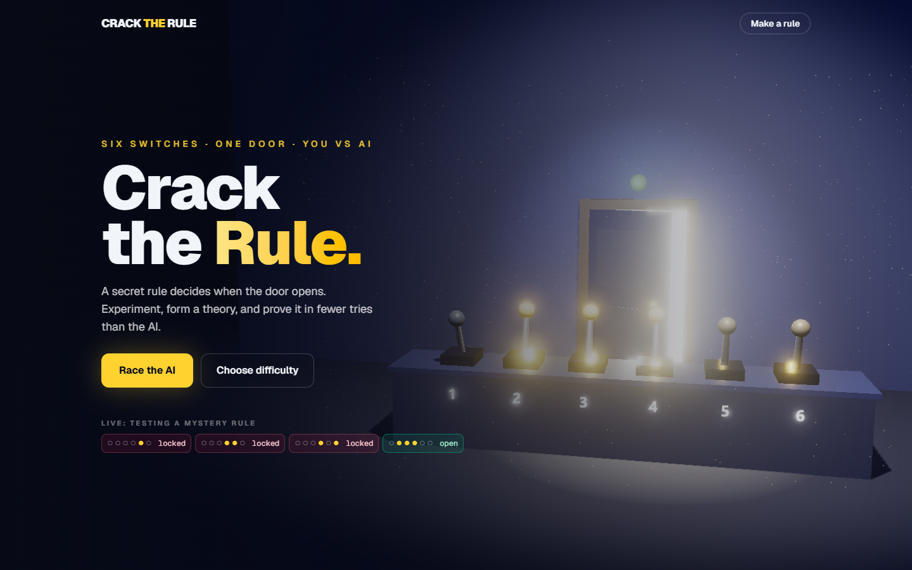
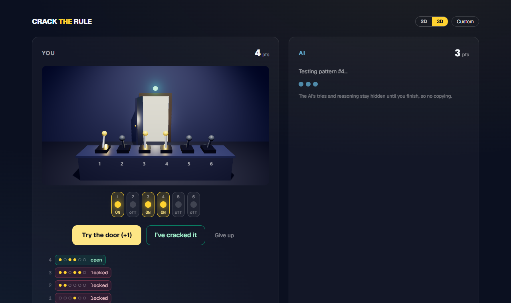
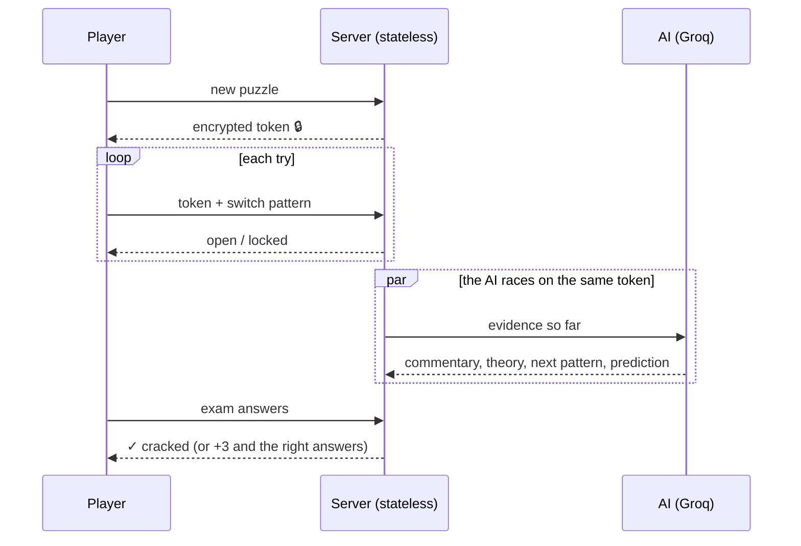

<div align="center">

# 🚪 Crack the Rule

**Six switches. One door. A secret rule.**<br/>
Experiment, form a theory, and prove it — in fewer tries than the AI.

[](https://cracktherule.vercel.app)

[](LICENSE)
[](https://nextjs.org)
[](https://threejs.org)
[](https://groq.com)
[](CONTRIBUTING.md)



</div>

## The game

A hidden rule decides when the door opens — maybe *"switch 2 on and switch 5 off"*, maybe *"exactly three switches on"*, maybe *"the pattern is a mirror image."* You don't know. Neither does the AI.

1. **🔬 Test** — flip switches, try the door. Every try costs a point.
2. **💡 Theorize** — which switches? How many? Neighbours? Symmetry?
3. **🎓 Prove it** — predict the door for 8 new patterns. Ace the exam to crack the rule. Miss one: +3 points.

You race an AI on the **same rule**. Lowest score wins. The AI's moves stay hidden until you finish — then you can watch its whole thought process: every theory, every prediction, every *"huh, didn't expect that."*



### Why it's fun to share

- **🔗 Make a rule, send a link.** Build your own devious rule and challenge friends: *"I cracked it in 9. The AI needed 14. Your turn."* The rule is encrypted inside the link, so no peeking at the URL.
- **🌀 Twist mode.** The rule secretly changes partway through. Who notices first — you or the machine?
- **🧊 2D or 3D.** A full three.js escape room with clickable levers, or a clean 2D board. Your call.

## What's inside

| | |
|---|---|
| **3D** | three.js scenes with bloom, light spilling from the door, drifting dust, and an attract-mode demo that plays itself on the landing page |
| **AI opponent** | `gpt-oss-120b` on Groq, playing through a strict JSON schema: live commentary, hypothesis, next probe, and a prediction committed *before* each result |
| **Rule language** | A small typed AST — specific switches, counts, parity, neighbours, symmetry, combined with AND / OR / XOR / IF-THEN — with a generator tuned per difficulty |
| **Stateless backend** | Puzzles travel as AES-256-GCM-encrypted tokens, so serverless functions can check answers without a database or exposing the rule |



## Run it yourself

```bash
git clone https://github.com/aasim-syed/crackTHErule.git
cd crackTHErule
npm install
cp .env.example .env.local   # then fill it in (see below)
npm run dev                  # → http://localhost:3000
```

| Variable | Required | What it does |
|---|---|---|
| `GROQ_API_KEY` | ✅ | Powers the AI opponent. Free key at [console.groq.com](https://console.groq.com/keys). |
| `PUZZLE_SECRET` | ✅ | Any long random string; encrypts puzzle links. Changing it breaks existing links. |
| `AI_MODEL` | | Override the model (default `openai/gpt-oss-120b`). |
| `AI_REASONING` | | `low` (default, fast) · `medium` · `high` (smarter, slower, more tokens). |

**Deploy your own:**

[](https://vercel.com/new/clone?repository-url=https%3A%2F%2Fgithub.com%2Faasim-syed%2FcrackTHErule&env=GROQ_API_KEY,PUZZLE_SECRET&envDescription=Groq%20API%20key%20for%20the%20AI%20opponent%2C%20and%20any%20long%20random%20string%20to%20encrypt%20puzzle%20links&envLink=https%3A%2F%2Fconsole.groq.com%2Fkeys)

## Project map

```
src/
├─ app/
│  ├─ page.tsx            landing page (3D hero)
│  ├─ play/page.tsx       the race
│  ├─ create/page.tsx     rule builder → share link
│  └─ api/                stateless route handlers (puzzle, probe, exam, grade, reveal, ai/*)
├─ components/
│  ├─ HeroScene.tsx       landing scene: bloom, dust, attract loop
│  ├─ Room3D.tsx          in-game 3D view with clickable levers
│  ├─ Game.tsx            race screen, exam, results, sharing
│  └─ Board.tsx           2D switches, door, pattern chips
└─ lib/
   ├─ rules.ts            rule AST, evaluator, generator, descriptions
   ├─ puzzle.ts           encrypted tokens, twist timing, exam grading
   ├─ ai.ts               AI opponent prompt + structured output
   └─ room-scene.ts       shared three.js room builder
```

## Contributing

Ideas, bug reports and PRs are very welcome — see [CONTRIBUTING.md](CONTRIBUTING.md). Some fun places to start:

- 🧩 **New rule types** — "switches 1 and 6 match", "at least one of each half", temporal rules
- 🔊 **Sound** — lever clunks, a door creak, a victory sting
- 🏆 **Daily puzzle + leaderboard** (needs server-side sessions; see limits below)
- 🧠 **Smarter AI** — better prompts, or a classic version-space solver as a "perfect play" benchmark
- 🌍 **Translations** and accessibility improvements

### Known limits

- Scores are tracked in the browser, so a determined player can cheat. Fine for a party game; a leaderboard would need server-side sessions.
- Groq's free tier allows ~8k tokens/minute. Busy deployments will see slower AI moves — add rate limiting or upgrade the Groq tier.

## License

[MIT](LICENSE) © 2026 Aasim Syed — free to play, fork, remix and deploy.
